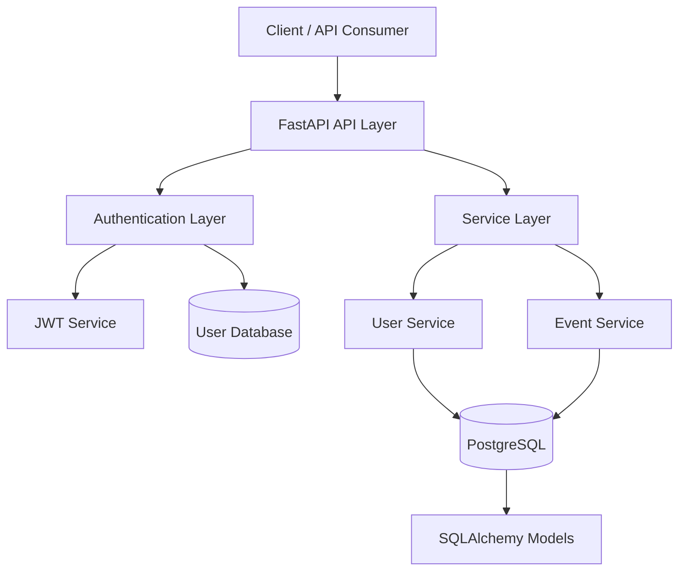

# Project Oracle - Event Management API & Authentication Platform

---

# Overview

Project Oracle is a backend REST API application designed to manage user authentication and event records through a structured, layered architecture.

The project was created to develop practical experience with backend engineering concepts including API design, authentication workflows, database management, testing, and software architecture.

The current version provides user registration, authentication using JWT tokens, protected API endpoints, and event record management.

The long-term goal of Project Oracle is to evolve into a security-focused monitoring platform capable of collecting infrastructure events from homelab environments and providing visibility into system activity, security events, and operational issues.

---

# Features

Project Oracle currently supports:

## Authentication

- User registration using email, username, and password
    
- Secure password hashing using bcrypt
    
- User authentication using email and password
    
- JWT token generation using Python-JOSE
    
- Protected routes requiring JWT authentication
    
- Current user retrieval through authenticated requests
    

## Event Management

- Create event records
    
- Retrieve stored events
    
- Search events by ID
    
- Update event information
    
- Delete event records
    
- Support predefined event types through enums
    

## Testing

Implemented test coverage includes:

- User creation
    
- Duplicate email validation
    
- Duplicate username validation
    
- Password hashing verification
    
- Successful login authentication
    
- Invalid password handling
    
- Invalid user authentication handling
    
- JWT token authentication
    
- Protected route authorization
    

---

# Tech Stack

## Backend

- Python
    
- FastAPI
    

## Database

- PostgreSQL
    
- SQLAlchemy ORM
    

## Authentication

- JWT authentication
    
- Python-JOSE
    
- bcrypt password hashing
    

## Configuration

- Pydantic Settings
    
- Environment variable configuration
    

## Testing

- pytest
    
- FastAPI TestClient
    
- SQLAlchemy test database
    

---

# Architecture

Project Oracle follows a layered backend architecture designed to separate responsibilities and maintain scalability.

```
Client
  |
  v
API Layer
  |
  v
Authentication Layer
  |
  v
Service Layer
  |
  v
Database Layer
  |
  v
PostgreSQL
```
___
# Architecture Diagram

The following diagram shows the relationship between the API layer, authentication system, service layer, and database layer.


---

# API Layer

The API layer defines all HTTP endpoints exposed by the application.

Responsibilities:

- Receive client requests
    
- Validate incoming data
    
- Return formatted responses
    
- Delegate business logic to services
    

The API layer does not contain business rules or database logic.

---

# Authentication Layer

Authentication is handled using JWT-based authentication.

The authentication workflow:

## Registration

1. User submits registration information
    
2. Password is hashed using bcrypt
    
3. User information is stored in PostgreSQL
    

## Login

1. User submits email and password
    
2. Password hash is verified
    
3. JWT token is generated using Python-JOSE
